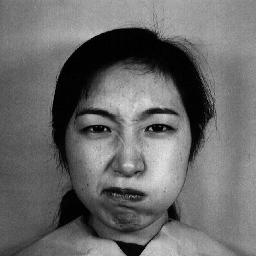
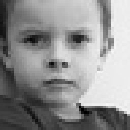

## Abstract

In this report, I would like to present the experiences I gained during the task of developing an emotion categorization system based on facial expressions. Throughout the development process, I explored several areas that were previously unfamiliar to me. As a result, I gained a broader understanding of various classification architectures and their peculiarities. I worked with four classification models, achieving varying levels of success. Additionally, I gained insights into determining the accuracy and reliability of each model, enabling us to select the most suitable model for a given task and situation.

## Introduction
In recent times, machine learning has undergone revolutionary advancements, leading to the emergence of increasingly better architectures. But have these advancements truly resulted in improvements? Can a machine surpass human knowledge? In the following pages, I seek to answer these questions in a subject that often challenges even the capacities of the human brain: predicting a person's emotional state based on facial expressions.

## Used Architectures
Image classification has been a developing field for quite some time, resulting in numerous useful and functional solutions. In this project, I dealt with three main types of architectures.

### VGG-based architectures
At the beginning of the task, my first idea was to construct a VGG-based architecture. I chose this approach based on initial articles and web pages, as it was theoretically expected to yield the best results [^1].

### VGG16
As a result, with the help of various articles [^2], I managed to implement my very first neural network, VGG16. However, challenges arose at this point. It became apparent that merely setting up the model was not enough. Acquiring the training dataset proved to be the most laborious task. Different image collections stored data in various formats and often did not use the same categories. As a solution, I chose three datasets: [^3] [^4] [^5]. Additionally, there were three more datasets available to me, but they were not evenly distributed. Some datasets contained only two categories, such as "happy" and "neutral." I omitted these images from the training database to ensure a more balanced distribution of classes. Consequently, I collected 29,220 training images and 3,534 validation images, which I divided into seven classes: "happy," "angry," "sad," "disgusted," "neutral," "surprised," and "afraid." As the number of images was relatively low compared to an MNIST dataset, I performed further data augmentation. With these preparations, the training could begin. Unfortunately, the training of this model proved to be unsuccessful as, no matter how much I reduced the batch size, the network did not fit into the memory of my graphics card.

### Modified VGG
Following this, optimizing memory usage became a central issue, and the transformation of VGG16 began. As a first step, I attempted to increase the dropout rate, decrease the batch size, and introduce checkpoints to reduce memory usage, but these measures proved to be insufficient. Therefore, I had no choice but to reduce the number of parameters. I achieved this by removing the fifth convolutional layer and the third fully connected layer, as well as decreasing the number of filters as follows: [32,64,128,256]. By successfully implementing these changes, the number of parameters decreased from 20,897,286 to 1,328,102. With these adjustments, the training dataset finally fit into my graphics card's memory.

However, I encountered another issue as the learning algorithm refused to learn properly. Despite training for 10 epochs, there was no improvement in learning accuracy after the first epoch. I found a possible solution to this problem in the following article [^6], which led me to assume that the images with different appearances might be causing the issue.

As visible in the comparison, the first image shows a much closer view of the face than the second one. Consequently, the feature maps were unable to learn distinct facial expressions. To test this hypothesis, I removed the JAFFE dataset from the training set.

|  |  |
|-|-|
| *angry man from the FER dataset*|*angry women from the JAFFE dataset*|

With these modifications, my model began learning adequately at the programmatic level. However, it started consistently confusing disgust with anger, disrupting the learning process and causing inconsistency. Upon reviewing the dataset, I concluded that facial expressions representing disgust and anger are often indistinguishable, even for the human eye based solely on images. Therefore, I made the decision to group these two emotions together, thereby better separating different emotions.

With these adjustments, the model began to learn effectively. I will later discuss its results in comparison with the other models.
## Residual-based architecture

### ResNet50
After the successful VGG network, I had the assumption that newer models would be better equipped for classification, being faster and more accurate. As a result, I started testing the capabilities of ResNet [^7]. However, instead of writing the entire network from scratch, I downloaded an existing code for testing, as I was unsure if my computer's specifications would be sufficient for running it [^8]. It quickly became evident that running ResNet with its 23 million parameters exceeded the capacity available to me.

### MobileNet-based architecture
As reducing the parameters of Residual networks proved to be much more challenging than reducing those of a VGG network, I was unable to find a solution despite various attempts. Therefore, in order to compare my VGG network with other networks, I turned towards models with significantly lower memory requirements [1].

### MobileNetV2
As a result, I chose MobileNetV2 [^9], thinking that since it was designed for mobile phones, my system would be capable of handling it. With this hope, I downloaded a test code to see if it would run properly [^10]. Once I confirmed that my system was capable of running the code, I began implementing my own version of MobileNet, based on the original research paper [^9]. Since I hadn't had the opportunity to implement code from an original research paper before, this posed the biggest challenge for me. Here, I first familiarized myself with the concepts of Depthwise and Pointwise convolution, for which I used the following sources to fully understand: [^11] [^12] [^13] [^14]. Using these, I was able to construct the basic structure of MobileNet, which consists of inverted residual blocks with a convolution at the beginning and end. However, the code was unable to run. The problem was exacerbated by the fact that the error did not consistently occur during execution. Unfortunately, I couldn't understand it on my own, so I was only able to figure out with the help of external code that the issue was with the initial filter and that it couldn't always be divided by zero. With the assistance of this code, I managed to write this function in a way that made my code work [^15]. The code not only helped me understand the first reshaping operation, but also the last one, as its absence consistently caused size-related errors in the program. Once I had made my program functional, testing could commence. This test ran with the same parameters and data augmentation processes as before.

## Results
I summarize the received results in the table below. 

| Model           | Parameters       | Runtime (hours) | Accuracy | Loss   |
|-----------------|------------------|------------------|----------|--------|
| VGG16           | 20,897,286       | -                | -        | -      |
| Modified VGG    | 1,328,102        | 1                | 0.4826   | 1.308  |
| ResNet50        | 23,593,734       | -                | -        | -      |
| MobileNetV2     | 2,283,334        | 1.3              | 0.2339   | 1.76   |
| MobileNetV2-custom | 2,281,830      | 2                | 0.2453   | 1.58   |

However, determining accuracy and loss is considered a good starting point for evaluating our model, and further investigations are suitable for a deeper analysis of our results.

Since these results would provide accurate results only if we had an equal number of learners for all six groups, which is not the case, for example, if our model has 60% accuracy for dataset A and 40% for dataset B, the overall accuracy of our model would drop to 60%. [^16]

Furthermore, we need to consider whether it is necessary for us to filter out false positives or false negatives. This would be important in a critical system, such as detecting a disease. However, since our model was not designed for such an environment, we do not need to take this case into account.

While false cases do not need separate handling in the calculation of accuracy, it is worthwhile to take a look at the Confusion Matrix to see the distribution of our system's predictions. The modified VGG Confusion Matrix reveals that our model did not learn the feature maps well, often guessing another facial expression close to the actual one.

|       | Angry | Fear | Happy | Neutral | Sad | Surprised |
|-------|-------|------|-------|---------|-----|-----------|
| **Angry**      | 87    | 4    | 155   | 104     | 66  | 75        |
| **Fear**       | 97    | 3    | 165   | 127     | 63  | 73        |
| **Happy**      | 122   | 11   | 284   | 195     | 115 | 152       |
| **Neutral**    | 92    | 9    | 197   | 167     | 78  | 105       |
| **Sad**        | 101   | 8    | 170   | 120     | 87  | 108       |
| **Surprised**  | 73    | 5    | 127   | 91      | 56  | 64        |

 For example, it frequently confused Happiness and neutral emotions, and it only rarely correctly identified Fear.

Additionally, it is advisable to examine the classification summary, which looks like this: 

|             | Precision | Recall | F1-Score |
|-------------|-----------|--------|----------|
| **Angry**       | 0.15      | 0.18   | 0.16     |
| **Fear**        | 0.07      | 0.01   | 0.01     |
| **Happy**       | 0.26      | 0.32   | 0.29     |
| **Neutral**     | 0.19      | 0.23   | 0.21     |
| **Sad**         | 0.09      | 0.15   | 0.16     |
| **Surprised**   | 0.11      | 0.15   | 0.13     |

Although I mentioned at the beginning that we do not need to consider false positive and false negative cases separately, it becomes clear from the table above that the emotion of fear is easily confused with other emotions.

Below, I would quickly present the calculation methods for the three columns: 
$$Precision = \frac{true positive}{true positive + false positive}$$,
$$Recall = \frac{true positive}{true positive + false negative}$$,\ 
and the F1 score, which is the harmonic mean of Precision and Recall, providing an indication of how many classes are predicted accurately (the higher, the better).
$$F1 = 2*\frac{1}{\frac{1}{precision}+\frac{1}{recall}}$$
While planning to compare the VGG architecture with the MobileNet model during the problem-solving process, the MobileNet test function does not run due to an UndefinedMetricWarning, giving an incorrect result. Unfortunately, I was unable to solve this problem within the desired time frame, so I cannot present the matrices associated with it.

## Summary 

The fact that we couldn't achieve better results with the models can be attributed to several factors. Perhaps the most significant issue is the quality of the dataset. It contains many images that can easily be identified as something else or even multiple things at once. Take, for example, the following image:

|  |
|-|
| *angry child*|

According to the creator of the training dataset, this image represents an angry expression. However, to me, it could just as easily be interpreted as a neutral face. Therefore, it's natural that our machine learning model won't be able to learn as accurately as possible since our classes lack easily distinguishable features, unlike trying to classify a banana and an apple. Continuing this line of thought, one might ask how humans are capable of recognizing emotions. The answer might lie in the environment. In addition to facial expressions, body language, environmental influences, and tone of voice further aid in recognizing emotions. Therefore, in the long run, it might be worthwhile to incorporate these factors into the calculations. If I had more time to complete this task, I would have definitely explored this possibility, in addition to experimenting with other architectures. One promising direction for this is Google's recently developed EfficientNet [^19].

[^1]: https://medium.com/@14prakash/image-classification-architectures-review-d8b95075998f
[^2]: https://towardsdatascience.com/step-by-step-vgg16-implementation-in-keras-for-beginners-a833c686ae6c
[^3]: FER adathalmaz
[^4]: CK+ adathalmaz
[^5]: The Japanese Female Facial Expression (JAFFE) http://doi.org/10.1109/AFGR.1998.670949
[^6]: https://towardsdatascience.com/how-to-build-a-data-set-for-your-machine-learning-project-5b3b871881ac
[^7]: https://arxiv.org/abs/1512.03385
[^8]: https://github.com/keras-team/keras-contrib/blob/master/keras_contrib/applications/resnet.py
[^9]: https://arxiv.org/pdf/1801.04381v4.pdf
[^10]: https://peltarion.com/knowledge-center/documentation/modeling-view/build-an-ai-model/blocks/2d-depthwise-convolution
[^11]: https://machinethink.net/blog/mobilenet-v2/
[^12]: https://peltarion.com/knowledge-center/documentation/modeling-view/build-an-ai-model/blocks/2d-depthwise-convolution
[^13]: https://www.youtube.com/watch?v=T7o3xvJLuHk&t=600s
[^14]: https://www.youtube.com/watch?v=HD9FnjVwU8g
[^15]: https://github.com/TenTen-Teng/MobileNet-V2/blob/master/mobilenetv2.py
[^16]: https://towardsdatascience.com/metrics-to-evaluate-your-machine-learning-algorithm-f10ba6e38234
[^17]: https://gist.github.com/RyanAkilos/3808c17f79e77c4117de35aa68447045
[^18]: https://github.com/Paralike/Human-Facial-Recognition
[^19]: https://arxiv.org/abs/1905.11946