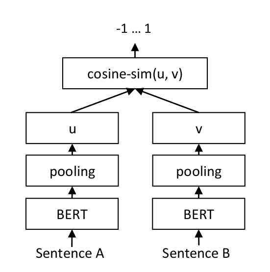

Our task was to create a system that examines scientific claims and determines whether they are supported or contradicted by any of the articles.

1. The system takes a scientific claim as input.
2. It identifies all relevant abstracts from a large corpus.
3. It labels the claims based on whether the relevant abstract supports (SUPPORT) or contradicts (CONTRADICT) them.
4. It selects sentences that prove the correctness of the labels.

## Plan

- [x] Preprocessing of data
- [x] Search for a method to extract relevant abstracts (TF-IDF algorithm)
- [x] Extraction of relevant abstracts from the corpus
- [x] Search for a machine learning technique suitable for sentence comparison (Sentence-BERT)
- [x] Application of Sentence-BERT to solve the task
- [x] Verification of the system's accuracy
- [ ] Training the system with the obtained training set
- [ ] Testing the system with test data
- [ ] Optimizing the system.

## Methods
### TF-IDF: term frequency–inverse document frequency
TF-IDF returns a value that determines how important a term is in a collection of documents. We used this algorithm to return the *k* most relevant abstracts for each claim.

### Sentence-BERT
Sentence-BERT is a modified variation of BERT that uses a siamese and triplet neural network structure to compare sentences based on cosine similarity. This method significantly reduces the time to find similar sentences compared to BERT, while maintaining similar accuracy. Sentence-BERT was used for labeling and selecting sentences.

Sentence-BERT operation:

#### Pretrained models
We selected three pretrained models for experimentation. The best-performing one, according to SBERT documentation, is based on mpnet and was trained on the NLI+STSb (Semantic Textual Similarity benchmark) dataset. Additionally, we selected two others, one based on XLM-R and the other based on distilroberta, both trained on the Paraphrase Data dataset.

| Model Name | Base Model | Pooling | Training Data | STSb Performance (Higher = Better) |
| :------: | :------: | :------: | :------: | :------: |
| stsb-mpnet-base-v2 | mpnet-base | Mean Pooling | NLI+STSb | 88.57 |
| paraphrase-xlm-r-multilingual-v1 | XLM-R | Mean Pooling | Paraphrase Data | 83.50 |
| paraphrase-distilroberta-base-v1 | distilroberta-base | Mean Pooling | Paraphrase Data | 81.81 |													

### Threshold Selection
We determined the label thresholds based on similarity values. We observed the approximate values around SUPPORT and CONTRADICT for each claim, and thus defined two threshold values. We refined the selection based on the results.

| NOT ENOUGH INFO | CONTRADICT | SUPPORT |
| :------: | :------: | :------: |
| x < 0.45 | 0.45 < x < 0.60 | 0.60 < x |
| x < 0.47 | 0.47 < x < 0.58 | 0.58 < x |
| x < 0.50 | 0.50 < x < 0.58 | 0.58 < x |
| x < 0.52 | 0.52 < x < 0.58 | 0.58 < x |

## Results

We first tried the three pretrained models on 25 claims using the previously determined thresholds, and then applied the best-performing model to all claims. For evaluation, we used training and corpus datasets to verify the results.

Evaluation criteria:
- Empty Evidence: where there is no information in the received Evidence / where there is actually none
- Non-empty Evidence: where there is actual information in the Evidence
- True SUPPORT: which is labeled as SUPPORT in the results / which is actually SUPPORT
- True CONTRADICT: which is labeled as CONTRADICT in the results / which is actually CONTRADICT
- False SUPPORT: which is labeled as SUPPORT in the results / which is actually CONTRADICT
- False CONTRADICT: which is labeled as CONTRADICT in the results / which is actually SUPPORT
- Correctly Predicted: claims correctly predicted / total number of tested claims
- Accuracy: accuracy calculated by us, in contrast to the task description, we do not only measure exact matches, but also accept when our prediction is present in the training set prediction.

### stsb-mpnet-base-v2

| Thresholds | 0.45/0.60 | 0.47/0.58 | 0.50/0.58 | 0.52/0.58 |
| ------ | :------: | :------: | :------: | :------: |
| **Empty Evidence** | 5/17 | 6/17 | 9/17 | 11/17 |
| **Non-empty Evidence** | 8 | 8 | 8 | 8 |
| **True SUPPORT** | 1/2 | 1/2 | 1/2 | 1/1 |
| **False CONTRADICT** | 1/2 | 1/2 | 1/2 | 0/1 |
| **True CONTRADICT** | 1/1 | 1/1 | 1/1 | 1/1 |
| **False SUPPORT** | 0/1 | 0/1 | 0/1 | 0/1 |
| **Correctly Predicted** | 7/25 | 8/25 | 11/25 | 13/25 |
| **Accuracy** | 0.28 | 0.32 | 0.44 | 0.52 |

### paraphrase-xlm-r-multilingual-v1

| Thresholds | 0.45/0.60 | 0.47/0.58 | 0.50/0.58 | 0.52/0.58 |
| ------ | :------: | :------: | :------: | :------: |
| **Empty Evidence** | 3/17 | 3/17 | 4/17 | 5/17 |
| **Non-empty Evidence** | 8 | 8 | 8 | 8 |
| **True SUPPORT** | 1/2 | 1/2 | 1/2 | 1/2 |
| **False CONTRADICT** | 1/2 | 1/2 | 1/2 | 1/2 |
| **True CONTRADICT** | 2/3 | 2/4 | 1/3 | 1/3 |
| **False SUPPORT** | 1/3 | 2/4 | 2/3 | 2/3 |
| **Correctly Predicted** | 6/25 | 6/25 | 6/25 | 7/25 |
| **Accuracy** | 0.24 | 0.24 | 0.24 | 0.28 |

### paraphrase-distilroberta-base-v1

| Thresholds | 0.45/0.60 | 0.47/0.58 | 0.50/0.58 | 0.52/0.58 |
| ------ | :------: | :------: | :------: | :------: |
| **Empty Evidence** | 5/17 | 5/17 | 7/17 | 8/17 |
| **Non-empty Evidence** | 8 | 8 | 8 | 8 |
| **True SUPPORT** | 1/2 | 1/2 | 1/2 | 1/2 |
| **False CONTRADICT** | 1/2 | 1/2 | 1/2 | 1/2 |
| **True CONTRADICT** | 2/2 | 2/2 | 2/2 | 2/2 |
| **False SUPPORT** | 0/2 | 0/2 | 0/2 | 0/2 |
| **Correctly Predicted** | 8/25 | 8/25 | 10/25 | 11/25 |
| **Accuracy** | 0.32 | 0.32 | 0.40 | 0.44 |

### Results on the Full Dataset
Based on all these results, the stsb-mpnet-base-v2 pretrained model achieved the best performance with the 0.52/0.58 thresholds, so we applied this model to the entire dataset.

| Thresholds | 0.52/0.58 |
| ------ | :------: |
| **Empty Evidence** | 126/304 |
| **Non-empty Evidence** | 505 |
| **True SUPPORT** | 356/631 |
| **False CONTRADICT** | 275/631 |
| **True CONTRADICT** | 143/323 |
| **False SUPPORT** | 180/323 |
| **Correctly Predicted** | 625/809 |
| **Accuracy** | 0.77 |

## Challenges:

The main challenge for us was the deadline. We didn't have time for training and subsequent evaluation with our own model.
Additionally, designing the evaluation was a difficult task, and while it was not perfect, the chosen models for comparison and the refinement of thresholds proved to be appropriate.