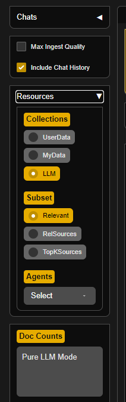

# Introduction

In the fast-paced world we live in, managing our daily schedules efficiently has become a challenging task. With the advent of Artificial Intelligence (AI), a new era of productivity and organization has emerged. AI-powered scheduling systems are revolutionizing the way we plan our days, offering personalized solutions that cater to individual preferences and priorities. Let's explore how AI can seamlessly integrate into our lives to create well-organized and productive daily schedules.

1. Personalized Planning:

AI-driven scheduling tools leverage machine learning algorithms to analyze your past behaviors, preferences, and priorities. By learning from your habits, these systems can generate personalized schedules that align with your goals. Whether you prioritize work, exercise, or leisure, AI ensures that your daily agenda is tailored to meet your specific needs.

2. Time Optimization:

One of the significant advantages of AI-based scheduling is its ability to optimize time usage. These systems can analyze data on your behalf, identifying patterns and trends that help in allocating time effectively. By considering factors such as traffic, weather, and historical data, AI can recommend the best times for meetings, tasks, and breaks, ultimately maximizing your efficiency.

4. Dynamic Adjustments:

Life is unpredictable, and plans often need to be adjusted on the fly. AI excels at adaptability, continuously monitoring changes in your environment and adjusting your schedule accordingly. Whether it's a last-minute meeting, unexpected traffic, or a change in priorities, AI can quickly reevaluate and rearrange your day to accommodate these shifts.

5. Smart Decision-Making:

AI scheduling systems are not just about time management; they also contribute to smart decision-making. By providing data-driven insights, these tools empower users to make informed choices about how to allocate their time. This can lead to better work-life balance, improved productivity, and reduced stress levels.

## Hands-On Example: Time Management with ChatGPT

To illustrate the practical application of AI in time management, let's consider a hands-on example using ChatGPT. Imagine you have a hectic day ahead, filled with work tasks, personal commitments, and a need for some relaxation. Instead of manually planning your day, you decide to enlist the help of ChatGPT to streamline the process.

1. **Go to out Website** 
    Visit our website at [Visit our AI's Website](http://51.124.42.42:7860/)

2. **Turn on Pure LLM mode**
    With the help of pure LLM mode you can increase the speed of the answer beacuse the system won't use any document during answering the question.\
    

3. **Providing Context:**
   Share relevant information about your day, including priorities, deadlines, and any specific preferences you have:

   ```markdown
    I'd like your assistance in scheduling my upcoming week. 
    I have provided a list of my meetings for each day, but I have some tasks that can be done flexibly during the week. 
    There are some consrains you have to look for. 
    - My working hours are from 9 to 17 From Monday to Friday 
    - I want to fit a 30 mins lunch break every day somewhere between 12 to 14.
    - I have a Standup every day from 9 o'clock to 9:30.
    - I want to have a 15 mins preparation time before every meeting.
    Can you help me organize my schedule effectively? Here are my meetings:

    Monday:
    - Demo with client A 11:00-11:30

    Tuesday:
    - Demo with client B 12:00-12:30

    Wednesday:

    Thursday:

    Friday:

    Additionally, I have the following tasks that need to be completed during the week, and they can be done flexibly, and their respective time it takes to be finished:
    - Create presentation. Duration: 2 hours
    - Catch up with with Client C: 30 mins
    - Write Documentation: 1 hours
    Feel free to suggest the most efficient way to organize my time, and if there are any gaps where I can tackle the tasks.
   ```

3. **Receiving Suggestions:**
   Powered by its language generation capabilities and knowledge of your preferences, provides detailed suggestions for your day:

   ```markdown
      Based on your provided meetings and tasks, here's a suggested schedule that meets your constraints:

   Monday:
   - 9:00-9:15: Preparation for Standup
   - 9:15-9:30: Standup
   - 10:00-11:00: Work on other tasks
   - 11:00-11:30: Demo with client A
   - 12:00-12:30: Lunch break
   - 13:00-15:00: Create presentation (can be done during lunch break or after work)
   - 15:00-17:00: Work on other tasks

   Tuesday:
   - 9:00-9:15: Preparation for Standup
   - 9:15-9:30: Standup
   - 10:00-11:00: Catch up with Client C (can be done before or after lunch break)
   - 11:00-12:00: Work on other tasks
   - 12:00-12:30: Lunch break
   - 13:00-14:00: Demo with client B
   - 14:00-15:00: Write Documentation (can be done during lunch break or after work)
   - 15:00-17:00: Work on other tasks

   Wednesday:
   - 9:00-9:15: Preparation for Standup
   - 9:15-9:30: Standup
   - 10:00-12:00: Work on other tasks
   - 12:00-12:30: Lunch break
   - 13:00-17:00: Free time to work on tasks (create presentation, write documentation)

   Thursday:
   - 9:00-9:15: Preparation for Standup
   - 9:15-9:30: Standup
   - 10:00-12:00: Work on other tasks
   - 12:00-12:30: Lunch break
   - 13:00-17:00: Free time to work on tasks (create presentation, write documentation)

   Friday:
   - 9:00-9:15: Preparation for Standup
   - 9:15-9:30: Standup
   - 10:00-12:00: Work on other tasks
   - 12:00-12:30: Lunch break
   - 13:00-17:00: Free time to work on tasks (create presentation, write documentation)

   By scheduling your tasks during lunch breaks or after work, you can ensure that you have enough time for your meetings and other tasks throughout the week. This schedule also allows for some flexibility in case any unexpected tasks arise during the day.
   ```

4. **Seeking Clarifications:**
   If you need further clarification or want to make adjustments, engage in a back-and-forth conversation with ChatGPT:

   ```markdown
   You: What about my morning routine? I usually start with a cup of coffee and reviewing emails.

   Absolutely! Begin your day with your morning routine, starting at 8 AM. Allocate time for coffee and email review until 9:30 AM before diving into focused work.
   ```

5. **Refinement and Finalization:**
   Refine the schedule based on the AI's suggestions, incorporating your own insights and preferences.

By utilizing AI-s in this hands-on example, you've efficiently generated a well-organized and personalized schedule for your day. The AI's natural language understanding and response capabilities facilitate a collaborative and interactive approach to time management, making the process smoother and more tailored to your specific needs.

# Conclusion:

In the era of AI, scheduling your day has evolved from a manual and time-consuming task to a dynamic and personalized experience. The integration of artificial intelligence into our daily lives has transformed the way we approach time management, offering tailored solutions that adapt to our individual needs and preferences. As AI continues to advance, we can expect even more sophisticated scheduling tools that further enhance our productivity and overall well-being. Embrace the AI revolution and let it optimize your daily schedule for a more efficient and balanced life.

